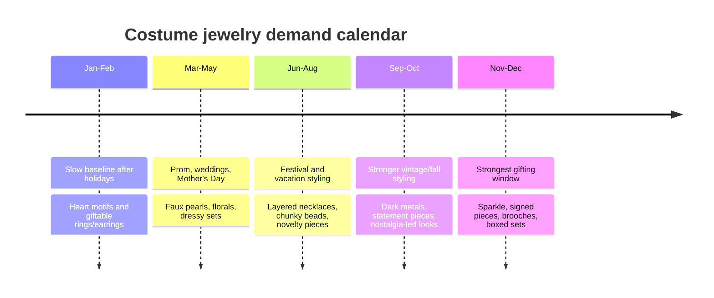
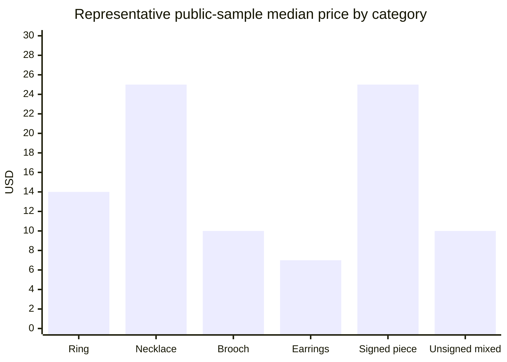
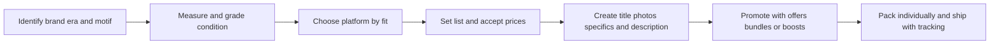

# Costume Jewelry Resale on eBay, Mercari, Poshmark, Depop, and Etsy

## Executive summary

Costume jewelry is a structurally attractive resale category because it sits at the intersection of three strong market forces: the continued growth of secondhand retail, sustained shopper interest in nostalgic and expressive accessories, and the operational advantage of lightweight, low-breakage inventory that is comparatively easy to photograph, store, and ship. The broad resale backdrop is supportive: thredUP’s 2026 Resale Report projects secondhand market growth at a 7.3% CAGR from 2025 to 2030, adding $23.3 billion in incremental value, while Etsy’s recent seasonal trend reporting repeatedly points to “nostalgic comfort,” “sparkle,” and gift-driven search behavior that maps unusually well to vintage and statement costume jewelry. citeturn9search18turn10search0turn28search17

The strongest practical finding from the public sample is that **unsigned everyday pieces usually live in the low teens**, while **signed or better-styled pieces often clear in the $20 to $50+ band** without needing precious-metal content. In the accessible sold-heavy sample, single Poshmark brooches sold at $8 to $9, a sold unsigned necklace cleared at $10, a sold rhinestone cocktail ring cleared at $28, signed Vargas earrings sold at $25, and a signed Karine Sultan necklace sold at $50. eBay public sold pages were especially useful for sets and lots; one vintage cameo-style necklace/bracelet/earring lot sold for $45. citeturn42view0turn42view1turn20view1turn38view2turn40view2turn40view1turn34view3

Platform fit matters as much as object quality. eBay is the best all-around venue for liquidity, cross-category discovery, and research because it supports rich item specifics, Best Offer, auctions, and Terapeak sales data; Poshmark is strongest when styling, bundles, and social selling matter; Mercari is effective for quick-turn low- to mid-ticket sales; Depop works best for trend-coded or aesthetic-led pieces; and Etsy is the premium venue for curated vintage, era-specific, or story-rich inventory that can justify more time spent on SEO and photography. citeturn24search0turn24search20turn30search3turn26search22turn31search7turn29search1turn25search2turn28search11turn44view1

For sellers trying to maximize value on everyday pieces, the most actionable rule is simple: **separate only the items with one or more clear value triggers**—a legible signature, intact rhinestones, a desirable motif, strong period styling, original box/card, or unusually good condition. Everything else should be priced to move or grouped into themed wearable lots. Public sold examples show how quickly signed or clearly merchandised pieces separate from the pack, while generic low-dollar pieces cluster below the level where high shipping and weak presentation can be tolerated. citeturn40view1turn40view2turn42view0turn42view1turn38view1turn40view3turn34view3

## Research scope and limitations

This report is US-centric and reflects public information accessible on June 3, 2026. The core evidence base is made up of official platform help pages and publicly visible item pages. For pricing, I weighted **public sold pages most heavily where they were actually accessible**, especially on eBay and Poshmark, then used representative public live-listing proxies on platforms where sold-only visibility was partial or inconsistent in the crawl. That means the pricing grids below are **directional rather than exhaustive**, and the most reliable conclusions are the relative ones: low-ticket unsigned pieces cluster low, signed/designer or visually distinctive pieces sit higher, and lots trade breadth for lower per-piece recovery. citeturn34view3turn20view1turn38view2turn38view3turn40view1turn40view2turn42view0turn42view1

Two additional caveats matter. First, fee structures are not equally transparent across platforms. Mercari’s publicly accessible help pages were internally inconsistent in this research pass: one page still described a 10% seller fee, while the current fees page described a buyer-side protection fee regime for listings created or updated on or after January 6, 2025. Second, Etsy’s public tools are excellent for listing/search guidance and fee policy, but not for building a true sold-only comp set from a buyer-facing interface. Those limitations are why the report favors **pricing bands and platform strategy** over false precision. citeturn29search15turn29search19turn44view1turn28search11

## Market overview and demand drivers

The resale macro backdrop is favorable. thredUP’s 2026 report projects continued secondhand expansion, and that matters for costume jewelry because jewelry is one of the easiest categories to add to a resale basket: it is low-cost to ship, easy to store, often impulse-friendly, and frequently bought as self-expression or gifting rather than as a needs-based purchase. Etsy’s trend reporting reinforces the same idea from the demand side, highlighting buyer interest in personal expression, nostalgia, and sparkle—exactly the traits that make vintage rhinestone, faux pearl, novelty brooch, and statement necklace listings legible to shoppers. citeturn9search18turn10search0turn28search17

Marketplace scale also supports depth of demand. eBay reported 134 million active buyers globally in 2025 and $79.6 billion in GMV for the year. Etsy reported 89.6 million active buyers in 2025. Mercari says it is used by 23 million people every month, and Depop said in 2025 that it had 35 million registered users. That does not mean costume jewelry behaves the same way everywhere, but it does mean the category is being exposed to very large pools of fashion and collectibles buyers. citeturn4search0turn10search11turn4search1turn8search0turn3search0

The demand drivers split into two broad lanes. The first is **everyday fashion resale**: gold-tone, silver-tone, faux pearl, beadwork, clip-ons, novelty brooches, and unsigned statement pieces bought as inexpensive styling tools. The second is **collectible or semi-collectible vintage**: signed makers, stronger mid-century styling, unusual motifs, and better-quality rhinestone construction. The public sold examples in this research pass support that split: everyday brooches and earrings sold in single digits on Poshmark, while signed Karine Sultan and Vargas pieces landed materially higher. citeturn42view0turn42view1turn38view1turn40view1turn40view2

Seasonality is real, but it is not uniform. The most defensible calendar is an inferred one: spring supports wedding-adjacent, faux pearl, floral, and dress-up inventory; autumn supports darker statement pieces and nostalgia aesthetics; and Q4 is the strongest gift period, especially for sparkle, novelty brooches, and signed pieces that present well in boxes or pouches. That seasonality inference is supported by Etsy’s spring/summer and fall/winter trend reports and by the broader holiday framing in thredUP’s resale data. citeturn28search17turn10search0turn9search18

## Platform analysis

The platform choice should follow the item’s strongest economic trait: **liquidity**, **social discovery**, **aesthetic fit**, or **premium curation**. The table below summarizes the practical implications.

| Platform | Audience and fit | Seller fee structure | Listing formats and tools | Best use for costume jewelry | Watch-outs |
|---|---|---|---|---|---|
| **eBay** | Broadest buyer pool; strong search, collectibles crossover, and best public research infrastructure. eBay reported 134M active buyers in 2025. citeturn4search0turn10search11 | eBay charges insertion fees and category-specific final value fees; store-subscriber jewelry schedules shown by eBay include **15% up to $5,000, then 9% over** for Jewelry & Watches, plus **$0.30 per order at $10 or less / $0.40 over $10**. Non-Store sellers also pay category-specific final value fees plus the per-order fee. citeturn43search12turn44view0 | Fixed price, auction, Best Offer, automated offers for store subscribers, Terapeak research, up to **24 free photos**, and listing video support. citeturn30search3turn24search20turn24search24turn24search0 | Best default venue for signed vintage, researched pieces, broad motif inventory, and lots. Strongest venue for market testing via auction or Best Offer. citeturn24search20turn34view3 | Fees can be meaningful on lower-ticket items, and sloppy titles/item specifics hurt visibility because Best Match rewards completeness and accuracy. citeturn24search0turn30search15 |
| **Mercari** | Mobile-first generalist marketplace; fast-turn environment for low- to mid-ticket goods. Mercari says it is used by **23M people monthly**. citeturn8search0turn29search8 | Public fee pages were inconsistent in this research pass: one Help page still states a **10% selling fee**, while the current fee page says listings created/updated on or after **Jan. 6, 2025** have a **buyer-side 3.6% Protection fee** and legacy listings are treated differently. Sellers should verify the in-app fee shown before listing. citeturn29search15turn29search19 | Fixed-price listings with offers, automatic “Offer to Likers,” and buyer-initiated bundles in the app. citeturn29search5turn29search12 | Good for quick flips, unsentimental pricing, and low- to mid-value unsigned pieces that need speed more than storytelling. | Policy complexity around current fees means margins should be checked at list time; very cheap jewelry can also look less attractive once buyer-side fees and shipping are visible. citeturn29search19turn18search4turn18search7 |
| **Poshmark** | Fashion/social-commerce audience; strong when styling, closet curation, bundles, and offer culture matter. citeturn27search3turn26search1 | **$2.95 flat commission below $15; 20% at $15 and above.** Buyer shipping is a flat **$6.49**, and bundles share one label up to **5 lbs**. citeturn26search22turn43search6turn31search3turn31search7 | Fixed-price listings, offers to likers, bundle discounts, Closet Clear Out, and Posh Shows. citeturn26search1turn26search5turn26search11turn26search9 | Best for nicely styled vintage singles, matching sets, and closets with enough related jewelry to push bundles. | The flat $6.49 shipping creates friction for $8–$12 items; low-dollar brooches and earrings often work better here only when bundled. That is an inference from the fee structure and sold examples. citeturn31search3turn42view0turn42view1turn38view1 |
| **Depop** | Trend-led fashion marketplace with strong vintage identity and a younger, style-tagged discovery culture. Depop said it had **35M registered users** in 2025. citeturn21search0turn3search0 | Depop’s fees page says **no base selling fee** for US/UK sellers, but a **buyer Marketplace fee** applies in the US/UK and **Boosted Listings** add a **12% boosting fee** for applicable listings. citeturn32search20turn43search7turn43search15 | Up to **4 photos + 1 video**, short descriptions, relevant keywords, up to **5 hashtags** and **2 brand hashtags**, Boosted Listings, bundles, and shop stats. citeturn25search7turn25search0turn25search4turn25search8 | Best for Y2K-coded, fairycore, grunge, maximalist, novelty, or strongly aesthetic costume pieces. | Generic mature vintage with no obvious aesthetic hook is harder here; irrelevant hashtags or misleading branding violate policy and can hurt trust. citeturn25search3turn25search11 |
| **Etsy** | Premium intent-driven audience for unique, handmade, and vintage goods; best for curated vintage and story-rich inventory. Etsy reported **89.6M active buyers** in 2025. citeturn4search1turn28search11 | **$0.20 listing fee**, **6.5% transaction fee** on the full order amount, country-specific payment processing fees, and optional Offsite Ads at **12% or 15%** depending on seller scale. citeturn44view1turn43search5turn43search1 | Fixed-price listings with the strongest built-in SEO stack: titles, tags, attributes, descriptions, first photo, reviews, and shop policies all affect discovery. citeturn28search11turn28search15turn28search3 | Best for curated vintage brooches, signed pieces, era-specific sets, boxed items, and higher-effort listings where storytelling can justify a premium. | Slower to list well than Mercari or Poshmark; not ideal for generic low-dollar pieces unless they are grouped or exceptionally styled. citeturn28search5turn44view1 |

A useful ranking of default platform fit for most sellers is: **eBay first for research and breadth; Poshmark and Mercari for faster social/mobile turns; Depop for aesthetic-led fashion jewelry; Etsy for premium vintage curation**. That priority order is an inference from platform search mechanics, fee structures, and the sold-price behavior visible in the public sample. citeturn24search20turn31search3turn29search1turn25search2turn28search11turn40view1turn40view2turn42view0turn42view1

## Pricing analysis

The pricing grid below is intentionally conservative. Rows marked **proxy-heavy** blend public sold pages with representative live public item pages because sold-only access was uneven outside eBay and Poshmark.

| Category | Public observed range | Indicative median | Indicative mean | Confidence | Evidence basis |
|---|---:|---:|---:|---|---|
| **Unsigned costume rings** | **$8–$28** | **$13.50** | **$14.83** | Moderate | Sold Poshmark cocktail ring at $28 plus Mercari public ring proxies at $8, $8, $12, and $18, and a sold modern/costume ring at $15. citeturn38view2turn18search4turn18search14turn18search10turn18search7turn37search4 |
| **Unsigned necklaces** | **$10–$26.99** for ordinary singles in the accessible sample; higher for stronger statement pieces | **$25.00** | **$20.66** | Moderate | Sold Poshmark necklace at $10; sold floral necklace at $25; eBay public necklace proxy at $26.99. A sold eBay vintage cameo-style set landed at $45, showing the premium for coordinated sets/lots. citeturn20view1turn19search9turn17search1turn34view3 |
| **Brooches and pins** | **$8–$19** | **$9.98** | **$11.82** | Strongest everyday single-piece row | Sold Poshmark brooches at $8 and $9; representative public brooch proxies at $8.99, $10.95, $15, and $19. citeturn42view0turn42view1turn36search10turn36search6turn18search12turn18search16 |
| **Bracelets** | **Generic everyday pieces around $10–$20; stronger standout items $40–$90+** | Not robust enough for a reliable sold-only median | Not robust enough for a reliable sold-only mean | Low | Public bracelet visibility was sparse and mixed: Poshmark had a sold $50 wire-wrapped example, while public proxies ranged from generic $10 styling pieces to high-list bracelet examples. Treat this row as directional. citeturn40view0turn19search3turn17search15turn45search14 |
| **Unsigned everyday earrings** | **$5–$9** in the clearest public sample | **$7.00** | **$7.00** | Moderate | Sold Poshmark earrings at $9 plus public eBay pair/set proxies at $5 and $6. Signed examples move materially higher. citeturn38view1turn36search3turn36search7 |
| **Signed designer costume pieces** | **$20.49–$50** for single public examples in this pass | **$25.00** | **$31.83** | Moderate | Mercari Sarah Coventry brooch proxy at $20.49; sold Vargas earrings at $25; sold Karine Sultan necklace at $50. Curated signed lots can go higher. citeturn18search6turn40view2turn40view1turn40view3 |
| **Unsigned mass-market mixed inventory** | **Most items clustered below $20; many brooches/earrings around $8–$10** | Rough mixed-sample median **about $10** | Rough mixed-sample mean **about $12.72** | Moderate | Inference from the combined public sample across rings, brooches, earrings, and low-end necklaces. The important operational takeaway is that generic pieces need efficient handling, bundling, or very fast-turn pricing. citeturn42view0turn42view1turn38view1turn18search4turn18search10turn18search14turn19search9turn17search1 |

The pricing data suggests three important rules. First, **median is more useful than mean** in costume jewelry because even modest outliers—signed pieces, statement necklaces, boxed sets, or curated lots—can pull the average up quickly. Second, **shipping friction matters a lot** on low-dollar inventory: a $6.49 Poshmark shipping charge is meaningfully more painful on a $9 brooch than on a $40 signed necklace. Third, **lots sell for convenience, not for maximum per-piece recovery**: the eBay sold cameo-style set at $45 and the Poshmark sold over-100-piece mixed lot at $148 are good gross-dollar moves, but not the same thing as maximizing each piece individually. citeturn31search3turn42view0turn42view1turn40view1turn34view3turn40view3

For everyday inventory, these are the most practical list-price ladders if the goal is maximizing value **without over-holding stale stock**:

| Item type | Fast-sale list target | Stretch list target | Likely accept floor | Best default platform |
|---|---:|---:|---:|---|
| Unsigned ring | $11–$16 | $18–$25 | $8–$12 | Mercari or eBay |
| Unsigned necklace | $15–$25 | $28–$40 | $10–$18 | eBay, then Poshmark if styled |
| Brooch/pin | $9–$14 | $16–$25 | $7–$10 | eBay or Etsy if strongly vintage |
| Bracelet | $12–$20 | $22–$35 | $10–$15 | eBay or Mercari |
| Everyday earrings | $7–$12 | $14–$20 | $5–$8 | Mercari or eBay |
| Signed vintage costume | $22–$40 | $45–$75 | $18–$30 | eBay or Etsy |
| Wearable mixed lot | Price by quality, not by weight alone; aim for curated themed lots | Higher if brands/motifs are visible | — | eBay and Poshmark |

Those ladders are strategic recommendations derived from the public-sample pricing above plus platform fees and shipping friction. citeturn44view0turn31search3turn29search19turn40view1turn40view2turn42view0turn42view1turn38view1

## Listing optimization and operations

### Search strategy, titles, and descriptions

Each platform rewards slightly different listing behavior, but the common denominator is accuracy. eBay’s Best Match guidance emphasizes clear titles, correct spelling, item specifics, accurate descriptions, and defect disclosure, and allows up to 24 photos for free. Mercari tells sellers to use photos, brand, and description fields well, with the first photo doing most of the work. Poshmark’s support content stresses clear titles and accurate details. Depop explicitly tells sellers to start with a title, use relevant searchable words, include measurements and condition, and avoid irrelevant hashtags. Etsy’s search documentation is the most explicit of all: titles, tags, attributes, descriptions, first photo, reviews, and policies all influence matching or ranking. citeturn24search0turn24search1turn24search5turn26search3turn25search0turn25search3turn28search11turn28search15

| Platform | Title formula | Description formula | SEO priorities |
|---|---|---|---|
| **eBay** | **[Brand/Unsigned] [Decade or “Vintage”] [Item Type] [Stone/Material] [Motif] [Color] [Closure/Size]** | Lead with exact identification, then measurements, then signature/hallmark, then condition/flaws, then shipping/returns. | Front-load searchable nouns; fill item specifics completely; show flaws; use 24 photos; use Best Offer on most jewelry unless the item is highly compable. citeturn24search0turn30search3turn30search6 |
| **Mercari** | **[Vintage/Modern] [Brand] [Item Type] [Color/Stone] [Size/Condition]** | 1 sentence identity, 1 sentence measurements, 1 sentence flaws, 1 sentence bundle/shipping note. | The first photo matters; use natural light; include brand/category/condition; rely on offers and Promote instead of overpricing far above market. citeturn24search5turn29search1turn29search5 |
| **Poshmark** | **[Brand] [Vintage/Style] [Item Type] [Color] [OS/Size]** | Short fashion-forward first line, then details, then condition, then bundle cue. | Clear title, accurate category/color, bundle discount, Offer to Likers, and style tags that match how fashion buyers browse. citeturn26search3turn26search1turn26search5turn31search7 |
| **Depop** | **Short natural-language title + 3–5 relevant search terms** | Plain-language item summary, measurements, fit/style, condition, then up to 5 relevant hashtags and up to 2 brand hashtags. | Relevance matters most; avoid spam terms; original photos only; use boosting selectively for seasonal or high-margin items. citeturn25search0turn25search2turn25search3turn25search7turn25search12 |
| **Etsy** | **Buyer-friendly title with decade + item type + material + motif + use case** | Detailed but readable narrative: what it is, when it dates from, measurements, condition, styling/gift use, then shop policies. | Use all 13 tags, complete attributes, good descriptions, strong first photo, and shop policies. Etsy search evaluates the listing holistically. citeturn28search11turn28search15turn28search3turn28search4 |

A practical title example by platform for the same item—a signed gold-tone floral brooch with clear rhinestones—would look like this:

- **eBay:** `Signed Trifari Vintage Floral Brooch Clear Rhinestone Gold Tone Pin 2"`  
- **Mercari:** `Vintage Trifari Floral Rhinestone Brooch Gold Tone Pin`  
- **Poshmark:** `Trifari Vintage Floral Rhinestone Brooch Gold Tone OS`  
- **Depop:** `Vintage Trifari floral rhinestone brooch gold tone pin #vintage #brooch`  
- **Etsy:** `Vintage Trifari floral brooch, gold tone rhinestone pin, mid century costume jewelry gift`  
These examples are synthesized from each platform’s own title/search guidance. citeturn24search0turn24search5turn26search3turn25search0turn28search15

### Photography and condition grading

Photo quality is not cosmetic in this category; it is part of risk management. eBay explicitly recommends high-quality photos from every angle with flaws shown, and allows video. Mercari recommends natural lighting and making the first photo your best. Depop bans stock photos and stresses original images. Etsy’s seller guidance for vintage and one-of-a-kind goods stresses detailed photography and condition specificity. citeturn24search0turn24search24turn24search5turn25search9turn25search12turn28search1turn28search5

Use a simple seller-side grading system and translate it into each platform’s allowed condition fields or text:

| Seller-side grade | What it means | Minimum photo set |
|---|---|---|
| **NOS / Like New** | Unworn or near-unworn; original card/box if present | Front, back, marks, box/card, clasp/backs |
| **Excellent vintage** | Light age wear only; stones present; no obvious plating loss | Front, back, signature, closure, one macro |
| **Very good** | Minor wear or faint tarnish; fully wearable | Front, back, flaw macro, closure, measurements |
| **Good** | Visible plating wear, darkening, small scratches, but wearable | All of the above plus every flaw |
| **Fair / Repair** | Missing stone, bent pin, damaged clasp, unmatched earrings, broken strand | Full damage documentation; sell as repair/craft unless rare |

That grading discipline aligns with official platform rules that require accurate descriptions and flaw disclosure, and it reduces “not as described” claims. eBay requires accurate item descriptions and condition selection; Mercari evaluates returns against the listing details and photos; Depop defines “significantly not as described” to include severe damage or undisclosed major flaws; Poshmark permits returns for items not as described; Etsy requires sellers to set return policies and operates Purchase Protection for damaged or not-as-described orders. citeturn30search6turn30search9turn24search21turn29search6turn25search1turn31search2turn31search20turn28search6turn33search2

### Bundling, shipping, returns, and buyer-conversion tactics

Bundling is the single best way to rescue low-value costume inventory. On eBay, lotting works best when the lot is curated around a theme—clip-ons, floral brooches, faux pearls, signed mixed lots, “wearable only,” “repair,” “Christmas pins,” and so on. The sold eBay cameo-style set at $45 and the sold Poshmark multi-piece mixed lot at $148 both show how bundling can convert breadth into sell-through, even if it lowers the per-piece recovery relative to breaking out every item. citeturn34view3turn40view3

Platform tools turn bundling into conversion when used correctly. eBay supports Best Offer and seller offers; Mercari’s Promote tool notifies likers when you cut price by 10% or more and supports buyer-initiated bundles; Poshmark lets buyers bundle with one shipping fee and supports Offer to Likers plus Closet Clear Out; Depop has bundle discounts/free shipping and Boosted Listings; Etsy supports free-shipping configurations and strong organic search if listings are optimized. citeturn30search3turn30search16turn29search1turn29search12turn26search1turn31search7turn26search11turn32search3turn25search4turn33search3turn28search11

Shipping should be matched to the item’s risk, not just its weight. Very cheap, non-fragile jewelry can go in economical packaging, but higher-value brooches, rhinestone pieces, and anything with prongs or delicate findings should be wrapped individually and shipped in a padded tracked format. Mercari’s help pages are unusually explicit here: First Class Envelope is flexible and only protected up to $20, while standard prepaid labels have stronger shipping protection, and Mercari recommends individually wrapping items with padding. Poshmark’s single $6.49 buyer-paid label up to 5 lbs makes it ideal for bundles but awkward for very cheap singles. Depop seller protection depends on using Depop Shipping labels in the US. Etsy lets sellers build shipping profiles and add insurance on labels. citeturn29search7turn29search11turn29search14turn31search3turn31search7turn32search2turn32search21turn33search0turn33search1turn33search8

Return policy discipline matters because every platform protects buyers when the item is not as described. eBay buyers can return not-as-described inventory even when the seller’s listing says “no returns” under Money Back Guarantee. Mercari returns must be raised within 72 hours of delivery and sellers must accept Mercari-approved returns. Poshmark sales are generally final, but buyers can open cases for non-delivery or not-as-described items, typically within 3 days of delivery. Depop buyer protection covers orders not received, damaged, or significantly not as described if reported within 30 days. Etsy sellers control normal return policies, but Purchase Protection can still refund qualifying not-delivered, damaged, late, or not-as-described orders. citeturn30search0turn30search17turn29search2turn29search10turn29search16turn31search2turn31search20turn32search1turn32search12turn28search6turn33search2turn33search6

## Sample templates and actionable pricing grid

The templates below are built from the official platform guidance summarized above: clear titles and item specifics on eBay, strong first photos and brand/condition fields on Mercari, clear searchable details on Poshmark, relevant keywords and hashtags on Depop, and buyer-friendly titles/tags/attributes on Etsy. citeturn24search0turn24search5turn26search3turn25search0turn28search11

| Common item type | Sample title template | Description starter | Keyword bank | Suggested starting price |
|---|---|---|---|---:|
| **Unsigned rhinestone cocktail ring** | `Vintage Gold Tone Rhinestone Cocktail Ring Adjustable Green Stone` | `Vintage costume cocktail ring with adjustable band. Gold-tone setting, green rhinestones, fully wearable. See last photo for size/fit notes and close-up condition.` | vintage ring, rhinestone ring, cocktail ring, adjustable ring, costume jewelry | $14.99 |
| **Unsigned statement ring** | `Vintage Costume Ring Silver Tone Statement Ring Size 7` | `Bold silver-tone vintage costume ring. Comfortable everyday statement piece. Minor wear from age shown in photos.` | vintage costume ring, statement ring, silver tone ring, fashion jewelry | $12.99 |
| **Faux pearl strand necklace** | `Vintage Faux Pearl Necklace Single Strand Gold Tone Clasp 18"` | `Classic faux pearl necklace with secure clasp. Great basic vintage styling piece. Measured unclasped; any wear to pearls or clasp is shown.` | faux pearl necklace, vintage necklace, bridal necklace, classic costume jewelry | $18.99 |
| **Bib or collar statement necklace** | `Vintage Gold Tone Bib Necklace Statement Costume Jewelry` | `Eye-catching statement necklace with strong vintage styling. Please review drop length, chain length, and close-ups of clasp and finish.` | statement necklace, bib necklace, vintage costume necklace, gold tone necklace | $29.99 |
| **Long beaded necklace** | `Vintage Beaded Necklace Long Layering Necklace Blue Gold Tone` | `Long vintage beaded necklace ideal for layering. Lightweight and easy to wear. Measurements and bead details shown in photos.` | long necklace, beaded necklace, layered necklace, retro jewelry | $19.99 |
| **Floral brooch** | `Vintage Floral Brooch Gold Tone Clear Rhinestone Pin` | `Vintage floral brooch/pin with secure clasp. Beautiful jacket, scarf, or hat accent. Front, back, clasp, and any wear are shown.` | floral brooch, rhinestone pin, vintage pin, gold tone brooch | $12.99 |
| **Novelty or animal brooch** | `Vintage Cat Brooch Gold Tone Novelty Pin Rhinestone Eyes` | `Whimsical vintage novelty brooch with detailed motif. Great giftable piece. Dimensions, clasp type, and condition are fully photographed.` | animal brooch, novelty pin, vintage brooch, gift brooch | $14.99 |
| **Clip-on rhinestone earrings** | `Vintage Clip On Earrings Clear Rhinestone Gold Tone` | `Vintage clip-on earrings with strong sparkle and comfortable clips. Please review the backs, clip tension, and macro photos for condition.` | clip on earrings, vintage earrings, rhinestone earrings, costume jewelry | $11.99 |
| **Pierced dangle earrings** | `Vintage Gold Tone Dangle Earrings Costume Jewelry` | `Lightweight vintage dangle earrings for pierced ears. Great everyday statement pair. See photos for scale, backs, and finish.` | vintage earrings, dangle earrings, gold tone earrings, fashion jewelry | $9.99 |
| **Signed designer piece** | `Signed Sarah Coventry Vintage Brooch Gold Tone Red Enamel Pin` | `Signed vintage costume jewelry by Sarah Coventry. Signature photo included. Measurements, clasp, and all visible wear documented for confident buying.` | signed brooch, Sarah Coventry, vintage designer jewelry, collectible costume jewelry | $29.99 |

A reusable multi-platform description skeleton that works unusually well for jewelry is this:

**Line one:** exactly what it is  
**Line two:** measurements  
**Line three:** signature or “unsigned”  
**Line four:** closure/back/clasp type  
**Line five:** condition with every flaw plainly stated  
**Line six:** shipping or bundle note that matches platform policy  

Example:

> `Vintage gold-tone floral brooch, unsigned.`  
> `Measures 1.75" across.`  
> `Roll-over clasp works properly.`  
> `Bright clear rhinestones; no missing stones seen.`  
> `Light surface wear to back from age; shown in last two photos.`  
> `Bundle-friendly; ships padded and tracked.`

That format directly answers the questions the major platforms use in search, claims review, and buyer decision-making. citeturn24search0turn24search5turn25search1turn31search2turn33search2

For everyday inventory, the most reliable value-maximizing routine is:

1. **Separate signed, boxed, or unusually strong motif pieces.**  
2. **Price ordinary unsigned singles to move, not to hope.**  
3. **Use eBay or Mercari for cheap singles; use Poshmark only if bundles are likely.**  
4. **Use Etsy only when the vintage story, photos, and SEO can justify the extra effort and fee stack.**  
5. **Lot low-end leftovers by theme, color, era, or wearability.**  

That guidance follows the public sold sample, the visible fee structures, and the buyer-conversion tools each platform makes available. citeturn34view3turn40view3turn31search3turn29search1turn30search3turn28search11turn44view1